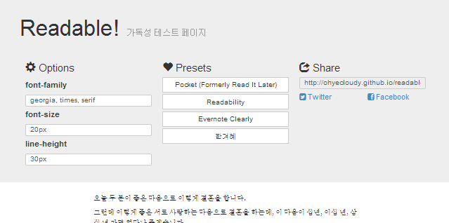

# Readable



`font-family`, `font-size`, `line-height`를 변경해 가독성을 테스트할 수 있는 페이지를 생성합니다.

## Example

[ohyecloudy.github.io/readable](http://ohyecloudy.github.io/readable/)에서 사용할 수 있습니다.

## Getting Start

```
$ git clone https://github.com/ohyecloudy/readable.git readable
$ cd readable
$ lein cljsbuild once

index.html을 브라우저에서 엽니다.
```

`ClojureScript`로 만들었습니다. [Leiningen](http://leiningen.org/)이 필요합니다.

## Read More About Readable

* [Readable 프로젝트 개발 일기](http://ohyecloudy.com/ddiary/categories.html#readable-ref)
* [가독성 그것이 문제로다. Readable 프로젝트를 마무리하고](http://ohyecloudy.com/pnotes/archives/1885)

## License

The MIT License (MIT)
